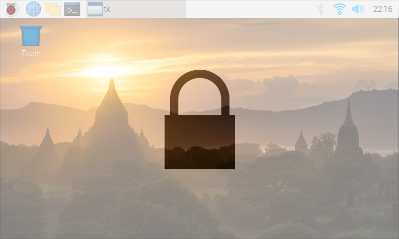

# Raspberry Pi Touchscreen Lock Screen

## Overview

This Python script adds a lock screen triggered by a GPIO input on a Raspberry Pi.



It has been wrote originally to be used in a project using the official 7" touchscreen, but it should work on any single-display Raspberry Pi setup.

## Dependencies

* [Tk](https://www.tcl.tk/software/tcltk/) (should be installed on most Raspberry Pi distros)
* [GPIOZero](https://github.com/gpiozero/gpiozero) (should be installed on most Raspberry Pi distros)
* A running compositor with transparency support, if needed (for example [xcompmgr](https://github.com/freedesktop/xcompmgr))

## Installing and running

Simply clone this repository and run `touchscreen-lock.py` :

```
$ git clone https://github.com/rshamsnejad/touchscreen-lock.git
$ cd touchscreen-lock
$ ./touchscreen-lock.py
```
The script runs an infinite loop, waiting for a 2-second press on a switch tied to GPIO 3 (physical pin 5) to toggle the lock screen. This particular GPIO input has been chosen, because it also allows the Pi to boot from a halted state.

If you also want to toggle the lock screen with a keyboard (default is *Ctrl+Shift+Alt+L*), add a `-k` or `--keyboard` CLI switch :

```
$ ./touchscreen-lock.py -k
```

## Customization

* If you want to use another pin, you can change the `LockButtonNumber` global variable
* The bounce time is set by default to 0.1s, but it can be tweaked to fit your own switch by changing the `LockButtonBounceTime` global variable
* The default 2s hold time can also be changed by setting the `LockButtonHoldTime` global variable
* If using the keyboard option, the key combination can be changed in the `LockKeys` global variable
* If you want to use a custom image in place of the padlock, set the `LockImagePath` global variable to the relevant image file.
